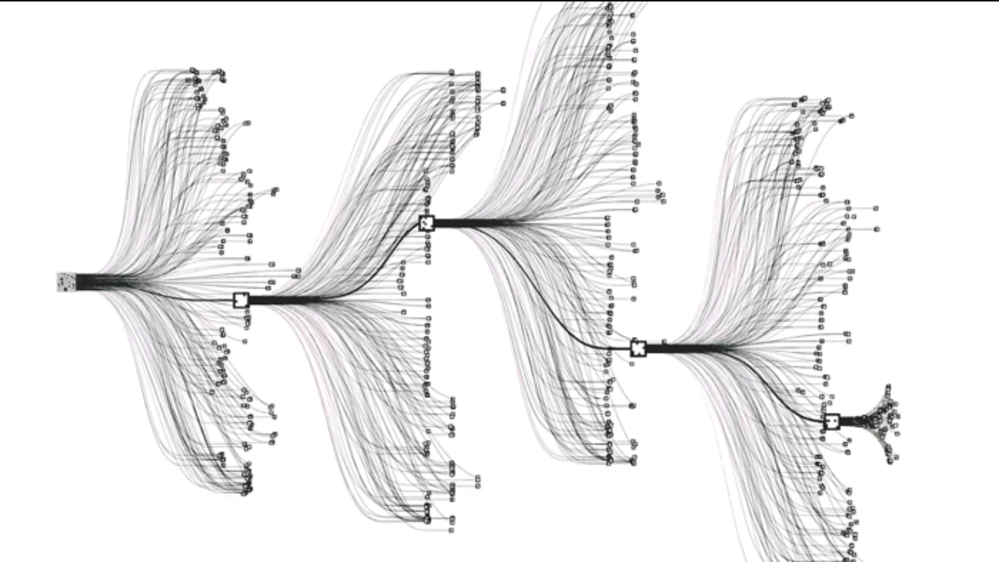

# JuliaGo.jl

An Julia chess engine based on MCTS and neural networks, similar to AlphaGo. This is a hobby project to further my understanding of artificial intelligence in the context of games and the Julia programming language. This began as an attempt to implement the full [AlphaGo paper](https://www.nature.com/articles/nature16961). This combines MCTS, neural networks and reinforcement learning. I only tackle the first two due to resource constraints (lack of GPUs) and time!

```@contents
Pages = ["index.md"]
```

## JuliaGo.jl Documentation

Get started with the [Documentation](@ref).

## Artificial Intelligence and Games

Two player games, such as Chess and Go, are often used as a testing ground for artificial intelligence algorithms. They provide a well-bounded problem, with obvious rules and a clear winner. Chess is a two-player zero-sum (an advantage for one side is an equivalent disadvantage for the other) perfect-information game and is the target of this work. A game of chess can be represented as a tree, referred to as the 'game-tree'. This game-tree consists of nodes representing states in the game. The game-tree in chess has a branching factor, the average number of child nodes per parent, of 31-35. In the Go the branching factor is 200-250. The number of number of nodes grows exponentially, rendering a brute force approach impossible and so we turn to artificial intelligence algorithms.


*The Go game-tree*

### Computer Chess

For a given chess board $S_0$, the aim of any chess engine (or human), is to find the optimal action $A_i$ from a set of actions $A_i \in \{A_1,\ldots,A_N\}$ that result in the next possible boards (states) $\{S_1, \ldots, S_N\}$. The optimal action is that which results, after many such actions, in a win for the player. The optimal value function $\nu^*(s)$ is strictly 0 for non-terminal states and, in terminal states, $[+1, 0, -1]$ for a win, draw and loss respectively. A brute-force approach would require recursively finding $\nu^*(s)$ for every action/state in a game-tree.

The standard algorithm for computer chess in minimax. In minimax the game-tree is recursively explored by depth-first search (DFS) until a given predecided depth. At each state the action is taken to minimise the opponent’s maximum reward. 
```math
\nu_i = \max_{a_i} \min_{a_{-i}}(\nu_i(a_i, a_{-i}))
```
where $i \rightarrow -i$ indicates the switching of players. At the predecided maximum depth, which is very unlikely to be a terminal state, the remaining sub-tree is discarded and instead $\nu^*(s)$ is approximated, $\nu(s) \approx \nu^*(s)$. $\nu(s)$, often called a static evaluation function, assigns a score to the state. This score reflects the likely outcome from the state and is necessarily heuristic, a function of the number of pieces and position, as a chess game is only decided by it's value in the terminal state (checkmate or draw). Good static evaluation functions are complex to create. The breadth of the game-tree is typically pruned with $\alpha-\beta$ pruning.


*Minimax algorithm for chess. At each state the action is selected that minimises the opponents maximum score. Only the terminal nodes are passed to the static evaluation function.*

## Monte Carlo Tree Search

Monte Carlo Tree Search (MCTS) offers an alternative methodology to an evaluation function. Instead of terminating the search and evaluating the position heuristically, MCTS evaluates the actions available from a position by conducting rollouts - searches to terminal without any branching. Taking the average of many rollouts provides an approximation to the value of the given action. This is formulated as (following Browne et al.[^1])

```math
Q(s, a) = \frac{1}{N(s,a)}\sum_{i=1}^{N(s)}\mathcal{I}_i(s,a)z_i
```
where
```math
\begin{aligned}
&Q(s, a) \text{ - the value of taking action $a$ from state $s$}\\
&N(s, a) \text{ - the number of times $a$ is selected from $s$}\\
&N(s) \text{ - the total number of simulations from $s$}\\
&z_i \text{ - the result of the $i$-th playout: [+1, 0, -1]}\\
&\mathcal{I}_i(s, a) \text{ - is 1 if $a$ was selected from $s$ on the $i$-th playout.}
\end{aligned}
```

These values that are assigned to a specific action are then used to guide the search to best-first strategy. An asymmetric game-tree is progressively built - at each iteration the tree is guided by the previous search. The value associate with the most promising moves should become more accurate as the tree is built as they are preferentially searched in further depth as the tree grows. The key to MCTS is finding the balance between exploitation and exploration: exploiting the current most promising moves and exploring those that currently look less promising but could turn out to be more optimal given further exploration.

### MCTS algorithm


The MCTS algorithm consists of 4 steps:

- *Selection*: from $S$ a selection policy that biases the search is recursively applied to child nodes until a non-fully expanded node is reached.
- *Expansion*: a child node is added to the tree.
- *Simulation*: a number of rollouts are played according to a default policy (a policy of selecting the next action) until a terminal state is reached
- *Backpropagation*: the results of the rollouts are propagated up the entire tree.

The MCTS can be terminated at anytime and $a$ is selected according to a policy.

### Biasing the search: the selection policy

The selection stage of the MCTS relies on a selection policy. The simplest policy would be to select child nodes from a uniform distribution. A more efficient method would bias the selection towards more promising actions. However, at the same time as exploiting promising actions, the selection policy must not totally discount less promising actions as these might be more favourable if the tree was explored in more depth. This is the key to *exploration-exploitation*. The most common selection policy is the Upper Confidence Bound for Trees (UCT):

```math
\mathrm{UCT} = \frac{w_i}{n_i} + C\sqrt{\frac{\ln N_i}{n_i}}
```
where
```math
\begin{aligned}
&w_i \text{ - is the number of wins associated with taking the action that results in this node i.e. the number of wins from the parent's perspecive.}\\
&n_i \text{ - is the number of simulations from this node.}\\
&C = \sqrt{2} \text{ - is a coefficient controlling the balance between exploration and exploitation.}\\
&N_i \text{ - is the number of simulations of the parent node.}
\end{aligned}
```
The child node with the maximum value of UCT is selected. The first term in UCT encourages the exploitation of promising actions and the second term biases towards less explored nodes. The selection policy results in asymmetric tree growth.


*The game-tree grows asymmetrically due to the selection policy.*

### Selecting an action

At the end of MCTS, we are left with a set of actions $\{A_1,\ldots,A_N\}$ each with an associated value $Q$. The standard method for selecting an action is the *robust child* method. This involves selecting $a_i$ associated with creating $s_i$ that has the highest number of visits (not the highest score i.e wins).

## Default Policy: training a neural network to predict moves

MCTS relies on a default policy to select moves in the rollouts. Randomly selecting moves would be a poor policy; it would require a great many rollouts to converge the value of the action. Instead we require a policy that selects the optimal action. This is impossible; if we knew the optimal action we would not be conducting MCTS. We approximate the optimal action with the action that a professional chess player would play. To extract this we need come supervised machine learning, for this we use a neural network (NN). The data set is a set of professional chess games. The input to the NN is the state and the output is the a probability distribution of legal moves.

### Neural network architecture

The NN architecture is based upon that in the [AlphaZero paper](https://www.pnas.org/doi/10.1073/pnas.2206625119). The input to the neural network is a binary array $\mathbf{z}^0 \in \mathbb{R}^d$. The paper states an input of $\mathbf{z}^0 \in \mathbb{R}^{(8\times8\times(14h+7))}$ with a history length of $h$ plies. Due to computational constraints we use only the current position $h = 1$ and discard the move counters to give an input of $\mathbb{R}^{(8\times8\times17)}$; 12 for the pieces, 4 for castling rights and 1 array for the colour of the side to move.


*A single ResNet block*

The NN is a Convolutional Neural Network (CNN), a NN that has seen great success in the fields of pattern recognition and computer vision. Specifically a Residual Neural Network (ResNet) is used. A single ResNet block is a two convolutional layers, each with a ReLu activation function, and batch norm between each layer. There is a skipped connection from the input of the two layers to the output, which is combined by addition and then a final ReLU.


*The neural network architecture. The value head is skipped in this work.* 

The output of the NN a $8\times8\times73$ tensor, encoding the 73 possible moves for every square. The softmax function is applied to the output layer to convert the values to a probability distribution. The loss function is the cross-entropy loss, that standard loss function for multi-class classification problems. The network is trained on a selection of professional games with mini-batch gradient descent and the ADAM optimizer. The NN was built with the Julia Flux library and training used a single GPU (almost twice as fast as CPU). However, a single GPU is not nearly enough to properly train the full network and so the number of ResNet blocks was decreased from 20 to 6. Once the neural network was trained a severe bottleneck was encountered: predicting a move was very slow. Since MCTS requires the prediction of many moves, as the more rollouts the better the approximation of the value of the action, this proved an insurmountable problem (for now!).

[^1] [Browne, C.B. et al. (2012) “A survey of Monte Carlo Tree Search Methods,” IEEE Transactions on Computational Intelligence and AI in Games, 4(1), pp. 1–43. Available at: https://doi.org/10.1109/tciaig.2012.2186810.](https://ieeexplore.ieee.org/document/6145622)
